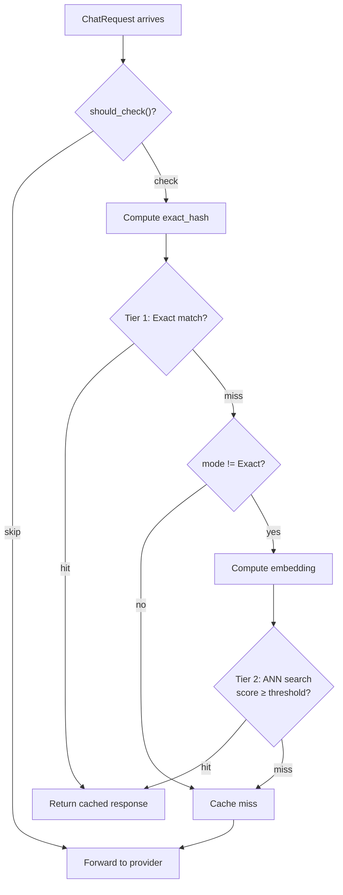

# srrldb

**Thin, opinionated wrapper around [SurrealDB](https://surrealdb.com) for the Gaud project.**

`srrldb` hides SurrealDB's generic engine parameter behind a single `Database` handle and re-exports the shared type system from `srrldb-types`. On top of this foundation, Gaud's **semantic cache** (`src/cache/`) stores and retrieves LLM prompt/response pairs using a two-tier lookup: exact SHA-256 hash matching and HNSW-backed approximate nearest-neighbour (ANN) vector search.

## Crate Layout

```
src/srrldb/
├── Cargo.toml          # Crate manifest (features: kv-mem, kv-rocksdb)
├── README.md           # ← you are here
├── src/
│   ├── lib.rs          # Re-exports `srrldb_types` as `types` + `Database`
│   └── database.rs     # Database, QueryBuilder, QueryResponse
├── core/               # Vendored SurrealDB core engine (internal)
└── types/              # Shared value type system (srrldb-types)
    └── README.md       # Detailed types documentation
```

The cache layer that consumes `srrldb` lives at:

```
src/cache/
├── mod.rs              # SemanticCacheService  (public facade)
├── store.rs            # CacheStore            (SurrealDB queries)
├── key.rs              # Hashing & semantic text extraction
├── types.rs            # CacheEntry, CacheMetadata, CacheError, …
└── embedder.rs         # OpenAI-compatible embedding client
```

---

## Feature Flags

| Feature | Description |
|---|---|
| `kv-mem` | In-memory datastore (ephemeral, good for tests) |
| `kv-rocksdb` | Persistent RocksDB-backed datastore |
| `cache-ephemeral` | Cache backed by the in-memory engine |
| `cache-persistent` | Cache backed by RocksDB |
| `allocator` | Custom allocator support (forwarded to core) |

> [!IMPORTANT]
> `cache-persistent` and `cache-ephemeral` are **mutually exclusive** — enabling both triggers a compile error.

---

## Public API — `srrldb` Crate

### `Database`

Opaque handle to an embedded SurrealDB datastore. It wraps an `Arc<Datastore>` and holds an owner-level `Session`.

```rust
pub struct Database {
    ds: Arc<Datastore>,
    session: Session,
}
```

#### Constructors

| Function | Feature Gate | Description |
|---|---|---|
| `Database::new_rocksdb(path: &str)` | `kv-rocksdb` | Open a persistent RocksDB-backed store at `path`. |
| `Database::new_mem()` | `kv-mem` | Open an ephemeral in-memory store. |

Both return `Result<Database, Box<dyn Error>>`.

#### Methods

| Method | Signature | Description |
|---|---|---|
| `use_ns_db` | `async fn use_ns_db(&self, ns: &str, db: &str) -> Result<(), Box<dyn Error>>` | Select both namespace and database in one call. Executes `USE NS … DB …`. |
| `query` | `fn query<'a>(&'a self, sql: &'a str) -> QueryBuilder<'a>` | Start building a SurrealQL query. Returns a `QueryBuilder` for chained `.bind()` calls. |

---

### `QueryBuilder<'a>`

Accumulates bound variables before executing a SurrealQL query. Created by `Database::query()`.

```rust
pub struct QueryBuilder<'a> {
    db: &'a Database,
    sql: &'a str,
    vars: BTreeMap<String, Value>,
}
```

#### Methods

| Method | Signature | Description |
|---|---|---|
| `bind` | `fn bind(self, (key, val): (&str, impl SurrealValue)) -> Self` | Bind a named parameter. Accepts any type that implements `SurrealValue`. |
| `execute` | `async fn execute(self) -> Result<QueryResponse, Box<dyn Error>>` | Execute the query and return wrapped results. |

`QueryBuilder` also implements `IntoFuture`, so `builder.await` is shorthand for `builder.execute().await`.

**Example:**

```rust
let mut resp = db.query("SELECT * FROM cache WHERE model = $model LIMIT $n")
    .bind(("model", "gpt-4".to_string()))
    .bind(("n", 10u64))
    .await?;
```

---

### `QueryResponse`

Thin wrapper around SurrealDB query results, supporting `.take()` / `.take_vec()` like the upstream client.

```rust
pub struct QueryResponse {
    results: Vec<srrldb_core::dbs::QueryResult>,
}
```

#### Methods

| Method | Signature | Description |
|---|---|---|
| `take<T: DeserializeOwned>` | `fn take(&mut self, idx: usize) -> Result<T, Box<dyn Error>>` | Deserialise the result at statement index `idx` into `T` (via JSON round-trip). |
| `take_vec<T: DeserializeOwned>` | `fn take_vec(&mut self, idx: usize) -> Result<Vec<T>, Box<dyn Error>>` | Like `take` but always returns a `Vec<T>`. |

---

### Re-exported Types (`srrldb::types`)

The entire `srrldb-types` crate is re-exported as `srrldb::types`. Key items:

| Type | Description |
|---|---|
| `Value` | Top-level enum for all SurrealDB data types (`Bool`, `String`, `Number`, `Array`, `Object`, `Datetime`, `RecordId`, …) |
| `Number` | Numeric variants (`Int(i64)`, `Float(f64)`, `Decimal(Decimal)`) |
| `Datetime` | Wrapper around `chrono::DateTime<Utc>` with `Datetime::now()` |
| `Object` | `BTreeMap<String, Value>` wrapper |
| `Array` | `Vec<Value>` wrapper |
| `RecordId` | Table + key identifier |
| `Kind` | Schema type enum for validation |
| `Variables` | `BTreeMap<String, Value>` alias used for query binding |
| `SurrealValue` (trait) | Bidirectional conversion: `into_value() -> Value` / `from_value(Value) -> Result<Self>` |
| `SurrealValue` (derive macro) | Auto-implements the trait for structs with `SurrealValue` fields |
| `object!` / `array!` | Convenience macros for literal construction |

See [types/README.md](types/README.md) for full documentation and examples.

---

## Public API — Semantic Cache (`src/cache/`)

### `SemanticCacheService`

High-level facade that bridges chat requests (`ChatRequest` / `ChatResponse`) and the low-level `CacheStore`.

```rust
pub struct SemanticCacheService {
    store: CacheStore,
    config: CacheConfig,
    stats: CacheStats,
}
```

#### `SemanticCacheService::new`

```rust
pub async fn new(config: &CacheConfig) -> Result<Self, CacheError>
```

Initialise the cache. Uses `CacheStore::persistent()` when the `cache-persistent` feature is active, or `CacheStore::ephemeral()` for `cache-ephemeral`. Returns `CacheError::InitFailed` if no backend feature is enabled.

| Parameter | Type | Description |
|---|---|---|
| `config` | `&CacheConfig` | Full cache configuration (see [Configuration](#configuration) below) |

---

#### `SemanticCacheService::should_check`

```rust
pub fn should_check(&self, request: &ChatRequest) -> bool
```

Returns `true` if this request should be checked against the cache. A request is **skipped** when:

- `request.stream` is `true`
- `config.skip_tool_requests` is `true` **and** the request has tool definitions
- The request model is in `config.skip_models`

---

#### `SemanticCacheService::lookup`

```rust
pub async fn lookup(&self, request: &ChatRequest) -> Result<CacheLookupResult, CacheError>
```

Two-tier cache lookup:

1. **Exact match** — SHA-256 hash of canonical request fields.
2. **Semantic match** — Embedding-based ANN search (only when `mode != Exact` and `embedding_url` is configured).

On a hit, the entry's `hit_count` is incremented and internal stats are updated.

| Parameter | Type | Description |
|---|---|---|
| `request` | `&ChatRequest` | The incoming chat completion request |

**Returns:** `CacheLookupResult` — either `Hit(CacheEntry, CacheHitInfo)` or `Miss`.

---

#### `SemanticCacheService::store`

```rust
pub async fn store(
    &self,
    request: &ChatRequest,
    response: &ChatResponse,
) -> Result<(), CacheError>
```

Store a request→response pair. Only caches responses where at least one choice has `finish_reason == "stop"`. After insertion, enforces `max_entries` by evicting the least-used entries.

| Parameter | Type | Description |
|---|---|---|
| `request` | `&ChatRequest` | Original request |
| `response` | `&ChatResponse` | Provider response to cache |

---

#### `SemanticCacheService::evict_expired`

```rust
pub async fn evict_expired(&self, ttl_secs: u64) -> Result<u64, CacheError>
```

Delete all entries older than `ttl_secs` seconds. Returns the number of entries removed.

---

#### `SemanticCacheService::flush_all`

```rust
pub async fn flush_all(&self) -> Result<(), CacheError>
```

Delete **every** entry in the cache.

---

#### `SemanticCacheService::flush_model`

```rust
pub async fn flush_model(&self, model: &str) -> Result<(), CacheError>
```

Delete all entries for a specific model name.

---

#### `SemanticCacheService::stats`

```rust
pub fn stats(&self) -> CacheStatsSnapshot
```

Return a point-in-time snapshot of cache hit/miss counters.

---

#### `SemanticCacheService::count`

```rust
pub async fn count(&self) -> Result<u64, CacheError>
```

Return the total number of cached entries.

---

### `CacheStore`

Low-level, vector-aware storage layer over the embedded SurrealDB instance. Not typically used directly — prefer `SemanticCacheService`.

#### Constructors

| Function | Feature | Description |
|---|---|---|
| `CacheStore::persistent(path, dimension)` | `cache-persistent` | RocksDB-backed. Applies schema + HNSW warmup. |
| `CacheStore::ephemeral(dimension)` | `cache-ephemeral` | In-memory. Applies schema, skips warmup. |

#### Methods

| Method | Description |
|---|---|
| `lookup(exact_hash, embedding, metadata, threshold, ttl_secs)` | Two-tier lookup (exact → ANN). |
| `insert(entry, metadata)` | Upsert a `CacheEntry`, validates embedding dimension and normalisation. |
| `record_hit(exact_hash)` | Increment `hit_count` and set `last_hit` timestamp. |
| `evict_expired(ttl_secs)` | Delete entries older than TTL. Returns count removed. |
| `evict_lru(max_entries)` | Delete excess entries by lowest `hit_count` then oldest `created_at`. |
| `flush_all()` | Delete all entries. |
| `flush_model(model)` | Delete entries for a specific model. |
| `count()` | Return total entry count. |

---

### Key Generation (`cache::key`)

Deterministic hashing and text-extraction functions. All hashes use SHA-256 with a `v1:` version prefix.

| Function | Signature | Description |
|---|---|---|
| `should_skip` | `fn(request: &ChatRequest, config: &CacheConfig) -> bool` | Returns `true` if the request should bypass the cache (streaming, tool requests, skip-listed model). |
| `exact_hash` | `fn(request: &ChatRequest) -> String` | SHA-256 hex digest of: model, messages (role + trimmed content), temperature (rounded to 2dp), max_tokens, tools JSON, tool_choice. |
| `system_prompt_hash` | `fn(request: &ChatRequest) -> String` | SHA-256 of system message content only. Used for ANN metadata filtering. |
| `tool_definitions_hash` | `fn(request: &ChatRequest) -> String` | SHA-256 of serialised tool definitions. Used for ANN metadata filtering. |
| `semantic_text` | `fn(request: &ChatRequest) -> String` | Extracts text for embedding: system message + `\n---\n` + last user message. Truncated to 8 192 chars. |
| `flatten_content` | `pub(crate) fn(content: &MessageContent) -> String` | Flattens `MessageContent::Text` or `::Parts` to a single string. Does **not** trim — callers trim if needed. |

---

### Embedder (`cache::embedder`)

Calls an **OpenAI-compatible** `/v1/embeddings` endpoint to obtain a vector for given text.

```rust
pub async fn embed(
    url: &str,
    model: &str,
    text: &str,
    api_key: Option<&str>,
    allow_local: bool,
) -> Result<Vec<f32>, CacheError>
```

| Parameter | Type | Description |
|---|---|---|
| `url` | `&str` | Full endpoint URL (e.g. `https://api.openai.com/v1/embeddings`) |
| `model` | `&str` | Embedding model name (e.g. `text-embedding-3-small`) |
| `text` | `&str` | Input text to embed |
| `api_key` | `Option<&str>` | Bearer token for the API (optional for local servers) |
| `allow_local` | `bool` | When `true`, SSRF protection is disabled — allows `localhost`, `10.x.x.x`, `192.168.x.x`, etc. |

**SSRF protection:** When `allow_local` is `false` (default), the URL's hostname is DNS-resolved and all returned addresses are checked against private/loopback/link-local ranges. Requests to non-public addresses are rejected with `CacheError::InvalidConfig`.

---

### Types (`cache::types`)

#### `CacheEntry`

A cached request→response pair, stored as a SurrealDB record.

```rust
#[derive(Debug, Clone, Serialize, Deserialize, SurrealValue)]
pub struct CacheEntry {
    pub exact_hash: String,              // SHA-256 of canonical request
    pub model: String,                   // LLM model name
    pub system_prompt_hash: String,      // SHA-256 of system messages
    pub tool_definitions_hash: String,   // SHA-256 of tool definitions
    pub semantic_text: String,           // Text used for embedding
    pub embedding: Option<Vec<f32>>,     // Normalised embedding vector
    pub request_json: String,            // Serialised ChatRequest
    pub response_json: String,           // Serialised ChatResponse
    pub created_at: srrldb::types::Datetime,
    pub hit_count: u64,
    pub last_hit: Option<srrldb::types::Datetime>,
    pub hash_version: String,            // Always "v1"
}
```

#### `CacheMetadata`

Metadata attached to entries for ANN filtering and analysis.

```rust
#[derive(Debug, Clone, Serialize, Deserialize, SurrealValue)]
pub struct CacheMetadata {
    pub model: String,
    pub system_prompt_hash: String,
    pub tool_definitions_hash: String,
    pub temperature: Option<f32>,
    pub confidence: Option<f32>,
}
```

#### `CacheLookupResult`

```rust
pub enum CacheLookupResult {
    Hit(CacheEntry, CacheHitInfo),
    Miss,
}
```

| Method | Return | Description |
|---|---|---|
| `is_hit()` | `bool` | `true` for `Hit` variant |
| `hit_kind_str()` | `Option<&'static str>` | `"exact"`, `"semantic"`, or `None` |
| `into_entry()` | `Option<CacheEntry>` | Unwraps the entry from a `Hit`, or `None` |

#### `CacheHitInfo`

```rust
pub struct CacheHitInfo {
    pub kind: CacheHitKind,       // Exact | Semantic
    pub score: f32,               // 1.0 for exact, cosine similarity for semantic
    pub threshold: f32,           // The configured similarity threshold
    pub metadata: CacheMetadata,  // Metadata that was matched against
    pub hash_version: String,     // Hash algorithm version
}
```

#### `CacheHitKind`

```rust
pub enum CacheHitKind {
    Exact,
    Semantic,
}
```

#### `CacheStatsSnapshot`

```rust
pub struct CacheStatsSnapshot {
    pub hits_exact: u64,
    pub hits_semantic: u64,
    pub misses: u64,
    pub hit_rate: f64,    // (exact + semantic) / total
}
```

#### `CacheError`

```rust
pub enum CacheError {
    InitFailed(String),
    SchemaFailed(String),
    LookupFailed(String),
    InsertFailed(String),
    InvalidConfig(String),
    DimensionMismatch { expected: u16, actual: usize },
    NotNormalized { magnitude: f32 },
    Embedding(String),
    Serialization(String),
    NotInitialized,
}
```

`serde_json::Error` converts into `CacheError::Serialization` automatically via `From`.

---

## Configuration

The cache is configured via the `[cache]` section of `llm-proxy.toml`. Every TOML key can be overridden by a `GAUD_*` environment variable.

| TOML Key | Env Variable | Type | Default | Description |
|---|---|---|---|---|
| `enabled` | `GAUD_CACHE_ENABLED` | `bool` | `false` | Master switch for the cache |
| `mode` | `GAUD_CACHE_MODE` | `"exact"` / `"semantic"` / `"both"` | `"both"` | Cache matching strategy |
| `path` | `GAUD_CACHE_PATH` | `PathBuf` | `$XDG_DATA_HOME/gaud/cache` | Persistent storage path (RocksDB) |
| `similarity_threshold` | `GAUD_CACHE_SIMILARITY_THRESHOLD` | `f32` | `0.92` | Minimum cosine similarity for a semantic hit |
| `embedding_url` | `GAUD_CACHE_EMBEDDING_URL` | `Option<String>` | `None` | URL of an OpenAI-compatible embeddings endpoint |
| `embedding_model` | `GAUD_CACHE_EMBEDDING_MODEL` | `Option<String>` | `None` (falls back to `text-embedding-3-small`) | Embedding model name |
| `embedding_api_key` | `GAUD_CACHE_EMBEDDING_API_KEY` | `Option<String>` | `None` | Bearer token for the embedding API |
| `embedding_dimension` | `GAUD_CACHE_EMBEDDING_DIM` | `u16` | `1536` | Vector dimension (must match the model) |
| `embedding_allow_local` | `GAUD_CACHE_EMBEDDING_ALLOW_LOCAL` | `bool` | `false` | Bypass SSRF protection for local embedding servers |
| `hnsw_m` | — | `u8` | `16` | HNSW M parameter (max connections per graph layer) |
| `hnsw_ef_construction` | — | `u16` | `200` | HNSW ef_construction (build-time search width) |
| `max_entries` | `GAUD_CACHE_MAX_ENTRIES` | `usize` | `10 000` | Maximum cached entries; LRU eviction above this limit |
| `ttl_secs` | `GAUD_CACHE_TTL` | `u64` | `3600` (1 hour) | Entry time-to-live in seconds |
| `skip_tool_requests` | `GAUD_CACHE_SKIP_TOOLS` | `bool` | `true` | Skip caching when tool definitions are present |
| `skip_models` | — | `Vec<String>` | `[]` | Models to exclude from caching |

**Precedence:** Environment variables > TOML file > built-in defaults.

### Example Configuration

```toml
[cache]
enabled = true
mode = "both"
similarity_threshold = 0.92
embedding_url = "https://api.openai.com/v1/embeddings"
embedding_model = "text-embedding-3-small"
embedding_api_key = "sk-..."
embedding_dimension = 1536
max_entries = 50000
ttl_secs = 86400               # 24 hours

# Local embedding server (Ollama, vLLM, TEI)
# embedding_url = "http://localhost:11434/v1/embeddings"
# embedding_allow_local = true
```

---

## SurrealDB Schema

The cache uses a single `SCHEMAFULL` table in namespace `gaud`, database `cache`:

```surql
DEFINE TABLE cache SCHEMAFULL;

-- Fields
DEFINE FIELD exact_hash            ON cache TYPE string;
DEFINE FIELD model                 ON cache TYPE string;
DEFINE FIELD system_prompt_hash    ON cache TYPE string;
DEFINE FIELD tool_definitions_hash ON cache TYPE string;
DEFINE FIELD semantic_text         ON cache TYPE string;
DEFINE FIELD embedding             ON cache TYPE option<array<float>>;
DEFINE FIELD request_json          ON cache TYPE string;
DEFINE FIELD response_json         ON cache TYPE string;
DEFINE FIELD created_at            ON cache TYPE datetime DEFAULT time::now();
DEFINE FIELD hit_count             ON cache TYPE int DEFAULT 0;
DEFINE FIELD last_hit              ON cache TYPE option<datetime>;
DEFINE FIELD hash_version          ON cache TYPE string;
DEFINE FIELD temperature           ON cache TYPE option<float>;
DEFINE FIELD confidence            ON cache TYPE option<float>;

-- Indexes
DEFINE INDEX idx_prompt_hash ON cache FIELDS exact_hash UNIQUE;
DEFINE INDEX hnsw_embedding  ON cache FIELDS embedding
    HNSW DIMENSION 1536 DIST COSINE;
```

> [!NOTE]
> The HNSW dimension is set dynamically from `config.embedding_dimension` at initialisation time.

---

## Lookup Flow



---

## Vector Validation

Before inserting or querying with an embedding vector, `CacheStore` validates:

1. **Dimension** — must equal `config.embedding_dimension` (default 1536). Mismatch → `CacheError::DimensionMismatch`.
2. **Finite values** — no `NaN` or `Infinity` allowed. Violation → `CacheError::InsertFailed`.
3. **Normalisation** — magnitude must be within `1e-3` of `1.0`. Violation → `CacheError::NotNormalized`.

`SemanticCacheService` normalises vectors automatically after receiving them from the embedding API.

---

## License

This crate is part of Gaud and follows the same license terms. See [LICENSE](../../LICENSE).
